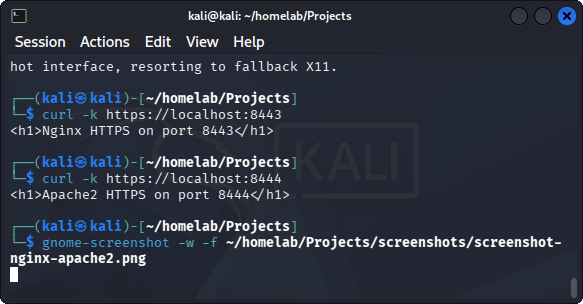
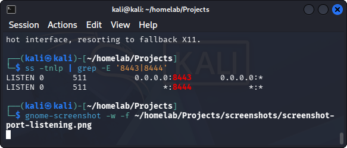

# Dual Web Server with SSL Certificates (HTTPS)

## Goal
Run Nginx and Apache2 simultaneously on VM, both with HTTPS, on different ports.

## Configuration
| Server  | Port | Protocol |
| ------- | ---- | -------- |
| Nginx   | 8443 |  HTTPS   |
| Apache2 | 8444 |  HTTPS   |

## What I did
- Installed Nginx and Apache2 on VM
- Generated separate self-signed SSL certificates for each server
- Configured Apache2 to listen on port 8444 with SSL
- Configured Nginx to listen on port 8443 with SSL
- Resolved port conflicts, verified both services running simultaneously

## Files
- 'nginx.conf' - Nginx HTTPS config (port 8443)
- 'apache-ssl.conf' - Apache2 HTTPS virtual host (8444)
- 'apache-ports.conf' - Apache2 port configuration
- 'nginx.crt' - Self-signed certificate (test only)
- 'apache.crt' - Self-signed certificate (test only)

## Key learnings
- Virtual host configuration for both Nginx and Apache
- SSL/TLS certificate generation with OpenSSL
- Port management and service isolation on a single host
- Using of 'ss -tnlp' and 'systemctl' for debugging and resolving issues

## Screenshots

